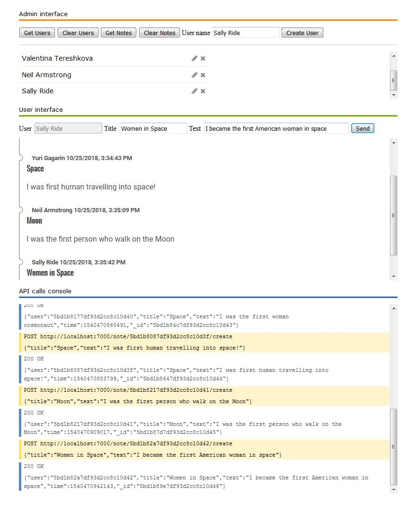

## Implementation of the NodeJS interview task

The web server's API supports CRUD operations for users and notes. For read and
delete it also supports some sort of query filter for getting/deleting sets of notes.

## Build and test environment

  |Module | Version|
  |-------|--------|
  |node | 9.6.1|
  |express | 4.16.3|
  |mongodb | 4.0.3|
  |mongo-mock | 3.3.2|

The API calls were tested with Firefox add-on 'HttpRequester' and the demo web page with Firefox browser.

## Configuration

The application uses __/server/config/config.js__ file as configuration for the server.
The default settings configure:

 * web server listening on __localhost:7000__
 * database engine __mongo-mock__ in-memory database
 * logger with __console__ transport only

To switch to real 'MongoDB' database, set `db.fake` parameter to `false` or comment it out.

To enable logging in daily rotated files set environment variable:
  `WEBSRV_LOG_FILE=<full/relative path to file with %DATE% placeholder in name>`

example:
```
  WEBSRV_ENV=dev
  WEBSRV_LOG_FILE=c:\logs\websrv_%DATE%.log
```

## Installation

Put application files in a folder, open console and type `npm install .`

## Test

  1. Run `node server/app.js`
  2. Open http://localhost:7000/notes.htm in web browser.
  3. Enter name of the new user in field __User name__ and press __Create user__ button. The user should appear below.
  4. Click on the user's name to select it as sender, enter title and text of the note
  in fields __Title__ and __Text__ and press __Send__ button.

  You can create more users and dynamically change the sender for the note by
  selecting desired user clicking on its name. You can refresh list of users and 
  notes by pressing __Get Users__ and __Get Notes__ buttons. You can do that after 
  refreshing the page when you were created users and notes before refreshing.
  
```
Note:
 1. Retrieving users and notes after restarting server is working only when real 
    MongoDB database is used.
 2. If you get list of notes from server before retrieving list of users, the notes 
    in the UI will show that are sent from 'Unknown user'.
```

The demo page contains small API console where you can see result of executing of the API
calls.


## Limitations

  The test web page does not have UI elements for executing all API calls supported from
  the web server, for example edit and delete of a note.
